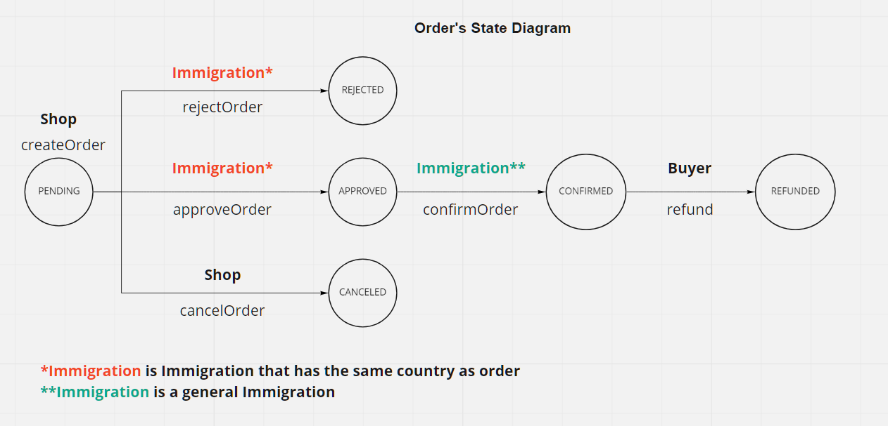

## Demo Link

https://maibokkrub.github.io/blockchain-refund/
Current version is not deployed to any Ethereum Testnet. It will require running local node.

## About

This project is created to implement VAT refund process on Blockchain. All stakeholders including Tourist, Shop and Government can participate in the process to reduce time and waste in existing refund process.

## Known Issues

-   Pages sometimes crash/load slowly when fecth data (need contract call optimization)
-   If MetaMask throw nonce error, You need to reset account in MetaMask. Reference [How to reset account in MetaMask](https://medium.com/singapore-blockchain-dapps/reset-metamask-nonce-766dd4c27ca8)

## Contract

Directory `./contracts`

Installing dependencies

```shell
cd contracts
yarn
```

Running the test script

```shell
yarn test
```

To run a local node,

```shell
yarn node
```

Open another terminal to deploy contracts and the demo situation

```shell
yarn deploy scripts/deploy.ts --network localhost
```

Don't forget to change the wallet Network to localhost.

## Accounts

Add `test test test test test test test test test test test junk` as a seed phase to MetaMask.

-   Account 2 is Thailand Immigration address
-   Account 3 is Germany Immigration address
-   Account 4 is Germany Shop address
-   Account 5 is Tourist address
-   Account 6 is Thailand Shop address

## Frontend

Directory `./ui/app`

Installing dependencies

```shell
cd ui/app
yarn
```

Starting localhost server

```shell
yarn start
```

Building & Deployment

```shell
yarn build
yarn deploy
```

## State Diagram



## Caution

The UI is served by Github Pages from branch `gh-pages`.
Please do not push any code to that branch.
